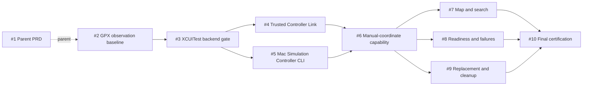

# Remote Location 分阶段 Lead 执行协议

## 结论

第一轮实现采用以下拓扑：

`Lead 统一编排 → 有界实现 → Lead 集成 → 阶段末双轴审查 → 独立 Modifier 修复 → Lead 验证与验收`

当前 backend 修订：ADR-0009 在 Stage A 探针之后将生产 Injection Backend 替换为 Xcode 27 的公开 `devicectl` location-simulation 命令。Stage A 的 XCUITest 记录保留为历史可行性证据；从 #5 的生产接线开始，协议中的 runner/session 描述按 `devicectl` 单后端执行，不保留第二条生产路径。

用户只与 Lead 对接。所有子 Agent、Session Worker、Reviewer 和 Modifier 都只向 Lead 返回；它们不能联系用户、互相派发、创建后代或改变 ticket/stage 状态。

父需求是 [GitHub Issue #1](https://github.com/sayoriqwq/remote-location/issues/1)。执行 tickets 是 [#2](https://github.com/sayoriqwq/remote-location/issues/2) 到 [#10](https://github.com/sayoriqwq/remote-location/issues/10)。Lead 不得自动修改或关闭父 Issue #1。

## 给 Lead 的启动提示

将本文件交给 Lead 时，使用下面这段提示即可：

```text
你是 remote-location 第一轮实现的唯一 Lead。

以 docs/execution-protocol.md 为执行协议，以 GitHub Issue #1、CONTEXT.md、已批准 ADR、
research 和当前 child issue 为产品事实来源。严格按 #2→#10 的依赖图工作；先完成
Preflight，只执行当前 frontier。保持本协议中的模型分配，不得静默替换不可用路由。

你负责计划、派发、所有权、集成、finding ledger、验证和用户沟通。子 Agent 或 Session
返回完成不等于 ticket accepted。凡是真机、Xcode、Developer Mode、签名或配对需要人工
动作，只由你向用户提出一个具体检查点；收到证据后继续。

现在从 Preflight 开始，报告当前 frontier、路由可用性、工作区/基线状态、Stage A 的所有权
与最小验证计划。不要提前实现被 blocker 阻塞的 ticket。
```

## 权威输入与冲突处理

按以下优先级解释工作：

1. 用户在当前 Lead 会话中的明确指令；
2. 父需求 [#1](https://github.com/sayoriqwq/remote-location/issues/1)；
3. `CONTEXT.md` 与已批准 ADR；
4. research 中记录的事实、限制与 prior art；
5. 当前 child issue 的目标、范围、验收和阻塞边；
6. 本协议中的执行、路由、审查与交接规则；
7. Lead 为当前派发包补充、且不改变上述决策的实现上下文。

本协议只决定如何执行，不改变产品范围。发现冲突、缺口或需要新技术决策时，执行者停止相关范围并报告 Lead；Lead 不能自行引入第二个 Injection Backend、private API、兼容矩阵或 Cross-App Propagation 承诺。

## 第一轮硬边界

- 只服务开发者自己的、ADR 记录的 Mac/Xcode/iPhone 环境。
- 只构建一个前台 Learning App、一个 Mac Simulation Controller CLI、一个 Trusted Controller Link 和一个可替换 Injection Backend。
- 只模拟一个静态坐标；不实现路线、速度、轨迹、后台模式、历史、收藏或云同步。
- 公开 XCUITest gate 未通过时不得继续产品实现，也不得静默切换 backend。
- Verified Simulation 只证明 Learning App 收到结果，不证明 system-wide 或 Cross-App Propagation。
- 不使用越狱、private header/selector、未文档化 DVT/RSD 注入、无认证 listener、遥测或设备唯一标识日志。

## Ticket 依赖图



`ready-for-agent` 表示 ticket 已经写到足以派发，不代表 blockers 已解除。Lead 按下文状态机计算真实 frontier：同一阶段的 blocker 至少达到 integrated，跨阶段的 blocker 所在阶段必须 accepted。

## 模型与角色分配

以下分配原样沿用既有协议。Lead 在 Preflight 验证当前宿主是否接受准确路由；历史探针不是当前调用的运行时证明。

| 职责 / 路径 | 模型与 effort | 用途与边界 |
| --- | --- | --- |
| Lead | GPT-5.6 Sol medium，由用户在任务开始时选择 | 唯一用户接口、Planner、架构与状态裁决者、集成者和最终验收者 |
| Native Advisor | none | 不引入执行前的额外多轮计划审批 |
| `stage_partner` | GPT-5.6 Terra medium custom role | 每阶段开始前做 fresh、只读的风险/依赖/所有权检查 |
| `standards_reviewer` | GPT-5.6 Terra medium custom role | 阶段末只读 Standards 审查 |
| `spec_reviewer` | GPT-5.6 Terra medium custom role | 阶段末只读 Spec 审查 |
| `stage_modifier` | GPT-5.6 Terra medium custom role | 只修复 Lead 接受的稳定 finding IDs |
| Native Executor policy | GPT-5.6 Luna low | policy 可存在，但禁止通过 `agents.spawn_agent` 请求 Luna |
| Luna Session Worker | GPT-5.6 Luna low | 仅通过准确 model/effort 的新 Session 处理低风险、易验证工作 |
| Spark Session Worker | GPT-5.3-Codex-Spark medium | 仅通过准确 model/effort 的新 Session 处理边界清楚的日常工程工作 |

### 路由硬规则

1. Lead 保持当前 root；不得创建第二个编排者。
2. Terra custom roles 必须使用其准确 role identity、fresh context 和 `fork_turns = none`。若当前接口不暴露或拒绝该 role，标记为 `unavailable`，不得替换成普通 Agent。
3. 不得用 `agents.spawn_agent` 请求 `gpt-5.6-luna`。Luna 只能走 `create_thread`/Session，指定 `gpt-5.6-luna`、`low`。
4. Spark 只能走 `create_thread`/Session，指定 `gpt-5.3-codex-spark`、`medium`。
5. 直接 Terra medium 实现只在当前宿主明确接受同 provider 的准确 model/effort override 时使用，并采用 fresh context；否则由 Lead 亲自实现高风险 ticket。
6. 创建接口接受路由只记为 `route accepted`；只有宿主返回有效 runtime metadata 才记为 `used and confirmed`。
7. 精确路由不可用时停止该派发并报告，不得静默降级到 root、另一模型或不同 effort。
8. Worker、Reviewer、Modifier 都不能创建子 Agent 或新 Session。

### Ticket 的建议实现路由

| Ticket | 首选实现者 | 理由 |
| --- | --- | --- |
| #2 | Terra medium direct Worker 或 Lead | 首次工程建立、签名、Core Location 与真机 GPX 需要较强判断 |
| #3 | Lead 或 Terra medium direct Worker | 物理设备硬 gate、公开 API 边界和 10 分钟证据不能交给低能力模型 |
| #4 | Terra medium direct Worker 或 Lead | TLS、六位码、Keychain 和认证拒绝路径属于安全边界 |
| #5 | Terra medium direct Worker 或 Lead | `devicectl` 参数边界、进程环境隔离与 backend neutrality 风险高 |
| #6 | Lead 或 Terra medium direct Worker | 跨 App/CLI/Link/backend 的核心领域状态与 request identity 收敛点 |
| #7 | Luna low Session pilot；失败则 Spark medium | UI 选择入口边界清楚、可通过既有 seam 自动验证 |
| #8 | Spark medium Session；出现权限/隐私歧义时提升 Terra/Lead | doctor/tutorial/status 主要是可控 fixture 与输出行为 |
| #9 | Lead 或 Terra medium direct Worker | 生命周期、清理与失败恢复跨越多个模块 |
| #10 | Lead | 最终集成、真机证据、边界审计与用户裁决不可下放 |

#7 是快速模型的首选 pilot。Pilot 若越界、伪造验证或造成明显返工，Lead 取消该路由在本项目的后续实现资格；不得反复用同一提示碰运气。

## 固定阶段拓扑

每个阶段使用同一拓扑：

`Lead + stage_partner → bounded implementation → Lead integration → standards_reviewer + spec_reviewer → Lead finding ledger → [必要时 stage_modifier] → Lead verification/acceptance`

| Stage | Tickets | 完成条件 | 阶段末审查重点 |
| --- | --- | --- | --- |
| A：真机可行性 | #2 → #3 | GPX baseline 成立，公开 XCUITest 完整通过 A/B fresh observation、public proxy clear、重复操作和 10 分钟 gate | 公开 API、证据真实性、Selected/Applied/Observed/Verified/Stopped 状态边界 |
| B：控制基础 | #4 与 #5 | Trusted Controller Link 和 Mac CLI/Injection Backend 两条分支分别可验证 | TLS/Keychain、认证、`devicectl` 参数与环境隔离、backend neutrality、错误边界 |
| C：核心能力 | #6 | 手工坐标完整走通 Selected → Applied → Observed → Verified | request identity、15 秒/25 米规则、Applied-but-not-verified、Cross-App 声明 |
| D：完整体验 | #7、#8、#9 | 地图/搜索、诊断/教程、替换/停止/恢复全部集成 | UI 状态汇流、只读 doctor、权限、清理、断线和隐私 |
| E：整体验收 | #10 | 当前个人环境完整 journey、自动化检查和边界审计通过 | 全量 Spec、公开 API/依赖/隐私、真机证据、未验证范围 |

阶段内部不为每张票启动双轴审查，但 Lead 必须逐票核对实际 diff、验收清单和最小验证，才能将 ticket 标为 integrated。

## Stage A：真机可行性

1. 串行完成 #2；建立最小 Learning App、观察 seam、验证逻辑和真机 GPX 证据。
2. Lead 将 #2 核对为 integrated 后才开始 #3；#2 要到 Stage A 审查通过后才成为 accepted。
3. #3 必须在同一 session 完成 A set、B replace、nil clear、多轮重复和至少 10 分钟稳定性。
4. Setter 无错误返回不是通过；每次 set/replace 都需要 Learning App 的 fresh observation 证据。
5. Clear 只有在公开 `XCUIDevice.shared.location` getter 读回 `nil` 时通过。Learning App 必须把仍显示的坐标明确描述为最后一次 observation，而不是活动模拟或已恢复的物理位置；新的物理 Core Location callback 只记为 best-effort 诊断，不设 gate 时限。
6. #3 的 A/B fresh observation、nil getter、重复操作、600 秒稳定性或公开 API 审计失败时：保留脱敏证据、保持 #3 open、所有下游保持 blocked，并向用户请求新的 backend 决策。不得进入 Stage B。

## Stage B：控制基础

#4 和 #5 在依赖图上可并行，但并不自动代表写入安全：

- #4 所有权集中在 Controller Link、pairing/TLS/Keychain、连接 UI 与 transport harness。
- #5 所有权集中在 Simulation Controller CLI、Injection Backend contract、`devicectl` 子进程边界与 CLI tests。
- 工程/Package manifests、共享领域类型、协议注册表和项目配置默认由 Lead 持有或串行修改。
- 如果当前结构无法形成不重叠所有权，Lead 必须串行执行，不得让 Workers 自行合并冲突。

Stage B 只证明两条基础分支；不得提前实现 #6 的 iPhone apply/verify 收敛流程。

## Stage C：核心能力

#6 是单一收敛 ticket，默认串行。Lead 必须持有以下跨层不变量：

- 选点不等于应用；backend acknowledgement 不等于 verification。
- 每个 apply 都有唯一 request identity，新请求立即使旧 verification 失效。
- Verified 必须同时满足 Applied、fresh timestamp、15 秒和 25 米。
- `isSimulatedBySoftware` 只作为诊断。
- Controller 协议保持 backend-neutral。
- 所有 UI、CLI 和报告都不得声称 Cross-App success。

Stage C 未 accepted 前，不派发 #7、#8 或 #9。

## Stage D：完整体验

#7、#8、#9 在依赖图上同时进入 frontier。建议调度：

1. #7 作为 Luna low Session pilot，所有权只覆盖选择入口与其测试。
2. #8 可交给 Spark medium Session；若它需要改变共享错误模型、权限边界或隐私策略，停止并提升给 Terra/Lead。
3. #9 默认由 Lead/Terra 串行处理，因为它会触及 App、Controller、Link 与 backend 生命周期。
4. 只有实际文件所有权不重叠时才并行 #7 与 #8；#9 与任何共享状态修改默认串行。
5. #8 的 doctor 只能执行固定 allowlist 内的只读命令；原始设备/签名输出不进入报告。iPhone 的 Location 与 Local Network 权限由 App 分别展示，Mac doctor 只给出 App 内检查指引。

Stage D 审查后，所有高严重级生命周期、权限、TLS、隐私或状态机 finding 都必须关闭，才能进入 Stage E。

## Stage E：整体验收

#10 由 Lead 主持，不是普通 Worker 票：

1. 先运行全量相关自动化检查、公开 API 扫描、依赖许可证审计和隐私扫描。
2. 再与用户完成一个合并的真机检查点：doctor → pairing → manual apply → map/search apply → replace → stop → reset。
3. 记录 request、Applied、Observed、Verified、clear 的时间与结果，去除所有唯一设备标识。
4. 并行启动 Standards 与 Spec 最终只读审查。
5. Lead 合并 findings，派发独立 Modifier，运行定向回归；高风险修改需要定向复审。
6. 只有自动化、真机证据、审查和边界审计全部通过，Lead 才能把 #10 标为 accepted。
7. Lead 可以关闭已 accepted 的 child issues；没有用户明确指令时不得关闭或改写父 Issue #1。

## 状态机

### Ticket 状态

`blocked → frontier → running → worker-done → integrated → accepted`

- `blocked`：至少一个 blocker 尚未被 Lead 接受。
- `frontier`：同一阶段 blockers 已 integrated，且此前阶段已 accepted，可以安排所有权和执行路由。
- `worker-done`：执行者已返回，但 Lead 尚未核对 diff/证据。
- `integrated`：Lead 已检查实际 diff、最小验证和范围；它可以解除同一阶段内的后继边，但 issue 仍保持 open。
- `accepted`：阶段审查、findings 和 Lead 验证允许该 ticket 完成；它可以解除跨阶段边并关闭 child issue。

Worker 的“done”不能跳过 integrated 或 accepted。Child issue 只在 accepted 后关闭。

### Stage 状态

`preflight → building → review-ready → reviewing → changes-required → verifying → accepted`

- 只有 Lead 可以进入 review-ready、verifying 和 accepted。
- Reviewer 的 approved 只是输入；Lead 仍需核对覆盖范围和阶段验证。
- Reviewer 无证据、工具失败或上下文缺失不能解释为通过。
- 未关闭的高严重级 finding 使阶段保持 changes-required。

## Preflight

Lead 在任何实现前必须报告：

1. 当前 GitHub child issues、状态和真实 frontier；初始 frontier 应只有 #2。
2. 当前分支、worktree、未提交/未跟踪改动和用户已有文件。
3. 是否存在首个 commit。若仓库仍无 commit，不得创建并行 worktree；选择串行共享目录，或先向用户取得建立基线 commit 的明确授权。
4. Lead、stage_partner、reviewers、modifier、Luna Session 和 Spark Session 的准确路由可用性；分别记录 requested、accepted 和 runtime-confirmed 证据。
5. 当前 Xcode、设备、Developer Mode、DDI、签名和 developer directory 的只读状态。
6. Stage A 的所有权、最小自动化验证、真机检查点和停止条件。

Preflight 只读，不得为了“准备环境”自动执行 sudo、切换全局 Xcode、重置设备、修改系统设置或创建外部资源。

## 并发与所有权

- 只并发当前 frontier 且实际写入集合不相交的 tickets。
- 并发 Git 写任务优先使用隔离 worktree Session；无首个 commit、依赖当前未提交状态或无法隔离时必须串行。
- 项目/Package manifests、共享领域状态、协议 schema、依赖锁定、签名设置和公共测试夹具是集成敏感区，默认 Lead 所有。
- 每个派发包必须声明允许修改、禁止修改、共享只读范围和越界停止条件。
- Worker 必须保留用户和其他 Agent 的现有改动；不得 reset、checkout、clean、覆盖或自行解决跨所有权冲突。
- Lead 在派发前记录 base revision，在返回后检查真实 diff；Session 的完成消息不是 diff 证据。

## 真机与人工检查点

只有 Lead 能向用户请求人工动作。Worker 遇到真机/Xcode UI 需要时返回 `NEEDS_HUMAN_ACTION`，包含：

- 需要用户做的唯一具体动作；
- 为什么自动化无法完成；
- 预期看到的信号；
- Lead 继续所需的最小证据；
- 安全取消或恢复方式。

Lead 应合并相邻人工步骤，避免频繁往返，但不能把未执行的动作推断为通过。任何包含 UDID、serial、ECID、tunnel address、hostname、证书私钥或配对 secret 的截图/日志，在进入 ledger 前必须脱敏。

## 验证节奏

| 层级 | 最小验证 |
| --- | --- |
| Ticket | 先建立相关失败测试，再做最小实现；运行单元/集成/UI/CLI 中与该票直接相关的检查 |
| Stage A | 真机构建、GPX baseline、XCUITest A/B fresh observation、nil getter clear、last-observation UI 语义、多轮重复、10 分钟稳定性、公开 API 审计 |
| Stage B | pairing/TLS/Keychain transport harness、backend contract、CLI 行为和物理 apply/stop smoke |
| Stage C | request identity、领域状态、15 秒/25 米 observation 序列、手工坐标真机 E2E |
| Stage D | 地图/搜索 UI journey、doctor fixtures、权限/隐私、A→B→stop/reset 生命周期 |
| Stage E | 全量相关自动化检查、公开 API/许可证/隐私审计、完整真机 journey 和最终双轴审查 |

测试断言外部可观察行为，不锁定内部类型名、进程拓扑、Network.framework callback 顺序或 `devicectl` 子进程实现细节。

## 阶段审查与 finding ledger

每个 stage 集成后并行派发两个 fresh、只读 reviewer：

- Standards：仓库规范、领域词汇、ADR、安全、公开 API、依赖、隐私和可维护性。
- Spec：父 Issue、当前 stage tickets、状态机、用户行为、验收 seam 和 Out of Scope。

每条 finding 必须包含稳定 ID、严重级别、轴、证据位置、风险和可验证修复条件。Lead 对 findings 逐条记录 `accepted`、`rejected-with-reason` 或 `needs-user-decision`。

只有 accepted findings 交给新的 `stage_modifier`。Modifier 逐 ID 返回 `fixed`、`not-fixed` 或 `needs-decision`，不能自行关闭 finding。Lead 检查实际 diff并运行定向验证；涉及 TLS、权限、设备 selector、子进程环境隔离、公开 API、Verified 规则或清理语义的修复必须定向复审。

## Lead ledger

Lead 至少维护以下字段：

| 字段 | 含义 |
| --- | --- |
| Stage / Ticket | 当前执行对象和 GitHub 链接 |
| Blockers / Frontier | 已接受依赖与当前可启动集合 |
| Requested route | 请求的模型、effort、role/session |
| Accepted route | 宿主明确接受的路由 |
| Runtime route | 宿主明确返回的运行时模型；没有则记未确认 |
| Base / Ownership | 基线 revision、worktree 与允许/禁止修改范围 |
| Diff evidence | Lead 实际检查的改动 |
| Automated verification | 命令、退出码、结果和未运行项 |
| Physical verification | 设备步骤、脱敏 observation 与清理结果 |
| Review findings | 稳定 finding IDs、verdict 与处置 |
| Modifier mapping | finding 到修复、测试和复审的映射 |
| Lead decision | 当前状态、理由和下一 frontier |

## GPT-5.6 Worker 派发模板

```text
<role>
你是 GitHub Issue #<N> 的实现 Worker。你不是 Lead、Reviewer 或产品决策者；不得创建后代。
</role>

<outcome>
一句话描述本票完成后可观察、可演示的行为。
</outcome>

<source_of_truth>
只列父 Issue、当前 ticket、相关 ADR/领域术语和已接受依赖；不要粘贴完整会话。
</source_of_truth>

<ownership>
允许修改：<模块/文件集合>
禁止修改：<相邻范围和 Lead-owned 集成敏感区>
共享范围只读；保留已有改动；需要越界时停止并报告。
</ownership>

<constraints>
列出本票真正相关的状态不变量、安全边界和 Out of Scope，每条只写一次。
允许读取、编辑授权范围并运行非破坏性的相关检查。
禁止外部写入、破坏性操作、范围扩张、私有 API 和启动子 Agent/Session。
</constraints>

<acceptance>
粘贴当前 ticket 的可观察验收条件，并标出必须保留的既有回归。
</acceptance>

<verification>
先在约定 seam 建立失败测试，再实现最小改动；运行指定的最小相关检查。
真机或 Xcode UI 需要人工动作时返回 NEEDS_HUMAN_ACTION，不要伪造结果。
</verification>

<stop_conditions>
需求冲突、blocker 未满足、所有权越界、公开/私有 API 不确定、安全边界改变、
无法建立失败测试或需要新的 backend 决策时停止并报告。
</stop_conditions>

<return>
返回：status、outcome、改动摘要、文件、验证命令/退出码/结果、人工检查点、未运行项、
剩余风险。不要自行关闭 issue 或宣称 integrated/accepted。
</return>
```

提示保持精简；全局规则由本协议和仓库 `AGENTS.md` 提供，不在每张派发包重复。该结构遵循 [GPT-5.6 Prompting best practices](https://developers.openai.com/api/docs/guides/latest-model?model=gpt-5.6#prompting-best-practices) 对目标、上下文、权限边界、证据、成功标准和输出格式的建议。

## Stage Partner 派发模板

```text
只读检查 Stage <X> 的启动条件。输入：本协议、相关 tickets、已接受 ledger、当前 repo 状态。
检查 blockers、frontier、跨票不变量、建议所有权、并发安全、最小验证和停止条件。
返回 STAGE_READY 或 STAGE_REVISE；列出证据、风险和具体修订。不要编辑、派发或决定 accepted。
```

## Reviewer 派发模板

```text
只读审查 Stage <X> 已集成的真实 diff。
权威输入：父 Issue #1、相关 ADR/CONTEXT、Stage tickets、本协议和 Lead 验证证据。
审查轴：<Standards 或 Spec，二选一>。
每条 finding 输出：稳定 ID、严重级别、证据位置、风险、可验证修复条件。
最后返回 APPROVED、CHANGES_REQUIRED 或 BLOCKED，并列出未覆盖范围。
不修改文件，不联系其他角色，不提出阶段外产品扩展。
```

## Modifier 派发模板

```text
你是 Stage <X> 的独立 Modifier。
只修复 Lead 接受的 findings：<稳定 ID + 证据 + 修复条件>。
允许修改：<所有权集合>；禁止修改：<范围>。
逐条建立或确认失败测试，再做最小修复；运行 <定向验证>。
按 finding ID 返回 fixed / not-fixed / needs-decision、实际修改和验证证据。
不要重新审查整个阶段，不关闭 finding，不顺手重构，不创建后代。
```

## 失败与降级

- #3 gate 的 A/B fresh observation、nil getter、重复操作、600 秒稳定性或公开 API 审计失败：停止整个下游，保存证据，请求用户做新的 backend 决策。clear 后没有新的物理 callback 本身不构成 gate 失败。
- 快速模型 pilot 越界或无法满足验收：取消该路由资格，提升到 Spark/Terra/Lead；不重复碰运气。
- 必需的精确 role/model route 不可用：标记 unavailable 并向用户报告；不静默替换。
- 真机、签名、Developer Mode、DDI 或 Xcode 阻塞：只读诊断后由 Lead 请求具体人工动作。
- 并行修改冲突：Lead 重新划分所有权或串行化，Worker 不自行合并。
- Reviewer 失败或没有证据：阶段不通过。
- Modifier 未关闭高风险 finding：阶段保持 changes-required。
- 最终全量或真机验证失败：#10 保持 CHANGES_REQUIRED/BLOCKED，即使前序 tickets 已关闭。
- 需要 private API、替代 backend、跨环境支持或特定第三方 App 测试：停止并请求用户决策。

## 完成定义

本协议完成不是“所有 Agent 都返回 done”，而是：

- #2–#10 的 blocker、实现、diff、自动化验证和人工证据均由 Lead 核对；
- #3 公开 XCUITest gate 按 ADR-0008 的 clear 语义保持通过；
- 每阶段 Standards/Spec findings 均已处置并验证；
- 当前个人环境的完整真机 journey 通过；
- 没有 private API、未批准 backend、云、遥测、历史或 Cross-App guarantee；
- #10 被 Lead accepted，并向用户报告真实未验证范围；
- 父 Issue #1 是否关闭仍由用户决定。
